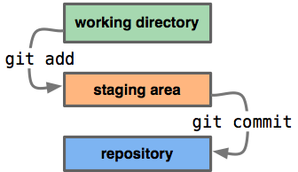

# ভূমিকা

## ভার্সন কন্ট্রোল \(Version Control\) :

ভার্সন কন্টোল হচ্ছে এমন একটি পদ্ধতি যা আপনার প্রজেক্টের\(project\) বিভিন্ন সময়ের পরিবর্তনগুলো সংরক্ষণ করে রাখে। ভার্সন কন্ট্রোল সিস্টেমের মাধ্যমে আপনি আপনার প্রজেক্টের পূর্বের যে কোন সময়ের স্থিতীশীল অবস্থায় ফিরে যেতে পারবেন।

## গিট\(git\):

গিট হচ্ছে একটি ওপেনসোর্স\(open source\) ভার্সন কন্ট্রোল সিস্টেম। এর মাধ্যমে একজন ব্যবহারকারী যতবার তার পরিবর্তনগুলো কমিট\(commit\) করবে ততবার গিট তার সম্পূর্ণ ফাইল সংরক্ষন করে রাখবে। গিট এর একটি বড় সুবিধা হচ্ছে একটি প্রজেক্ট নিয়ে অসংখ্য ডেভেলপার\(developer\) একই সময় কাজ করতে পারে। আপনি চাইলে ইন্টারনেট সংযোগ ছাড়াও কাজ করতে পারবেন।

আসুন দেখে নেই গিট এর বহুল ব্যবহৃত কমান্ডগুলো\(command\)-

* git init -একটি নতুন রিপোজিটরি\(repository\) তৈরি করার জন্য।
* git clone – পূর্ব থেকে বিদ্যমান কোন রিপোজিটরির সম্পূর্ণ তথ্য ডাউনলোড করার জন্য
* git commit – অফলাইন\(offline\) রিপোজিটরিতে স্থায়ীভাবে কাজ সংযুক্ত করার জন্য
* git pull – রিমোট\(remote\) রিপোজিটরি থেকে ফাইল ডাউনলোড করে অফলাইন রিপোজিটরির সাথে merge করার জন্য
* git push – অফলাইন রিপোজিটরি থেকে ফাইল রিমোট রিপোজিটরিতে আপলোড করার জন্য

## কাজের ধাপসমূহ:

আমরা যখন লোকাল\(local\) রিপোজিটরিতে কোন পরিবর্তন করি তখন আমরা working directory-তে থাকি। git add কমান্ড দেয়ার পর সেটা staging area তে যায় এবং git commit কমান্ড দেয়ার পর সেটা স্থায়িভাবে লোকাল রিপোজিটরিতে যুক্ত হয়। পরবর্তিতে চাইলে সেটা রিমোট রিপোজিটরিতে git push কমান্ড দিয়ে আপলোড করে দেয়া যায়।

